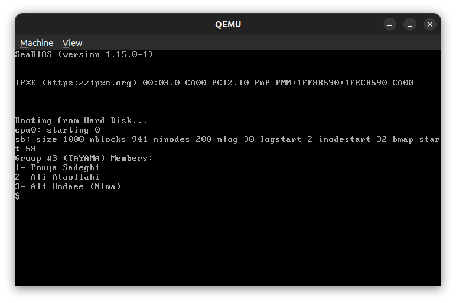
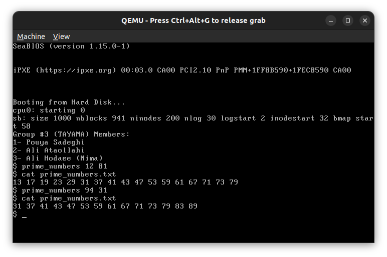

# os-project1
## installation
### install dependencies
```shell
sudo apt install qemu qemu-system-x86
```
### run xv6
**Attention** make sure you are in codes/xv6 directory

```shell
make
```
```shell
make qemu 
```

or if you want to run in current terminal:
```shell
make qemu-nox
```

***Tips:***

    use `ctrl+a c` to create a new terminal in qemu
    use `ctrl+a n` to switch to next terminal
    use `ctrl+a p` to switch to previous terminal
    use `ctrl+a x` to close current terminal
    use `ctrl+alt+g` to release mouse

## clean generated files:
```shell
make clean
```
***
## run and test user level app


***
## debug xv6
for information about debugging with ```gdb```  see [troubleshooting](troubleshooting.md) section.
***
## how xv6 works
### how can ```xv6``` get inout to the console?
```xv6``` uses ```uart``` to get input from console and send output to console.
### how can ```xv6``` get input from keyboard?
```xv6``` uses ```ps2``` to get input from keyboard and mouse.
### how input struct help?
```xv6``` uses ```input struct``` to get input from keyboard and mouse.
when user enter a character, ```input.e``` increases by one and ```input.buf``` stores the character.
after entering ```enter``` or ```Ctrl + D```or entering more than ```INPUT_BUF``` characters, 
```input.w``` gets equal to ```input.e```. then ```input.r``` starts to increasing until it gets equal to ```input.w```.
- ```input.r``` is the index of the first character in ```input.buf``` that is not read yet.
- ```input.w``` is the index of the first character in ```input.buf``` that is not written yet.
- ```input.e``` is the index of the first character in ```input.buf``` that is not entered yet.
- ```input.buf``` is the buffer that stores the characters that are entered by user.