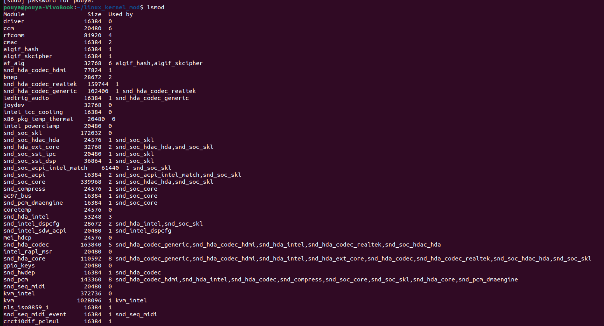
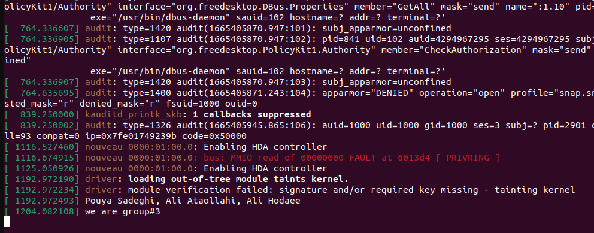

# os-project1

## instructions

compile module
```shell
make
```

load to kernel
```shell
sudo insmod driver.ko 
```


remove from kernel
```shell
sudo rmmod driver
```

to see kernel logs
```shell
sudo dmesg
```


to clean directory
```shell
make clean
```